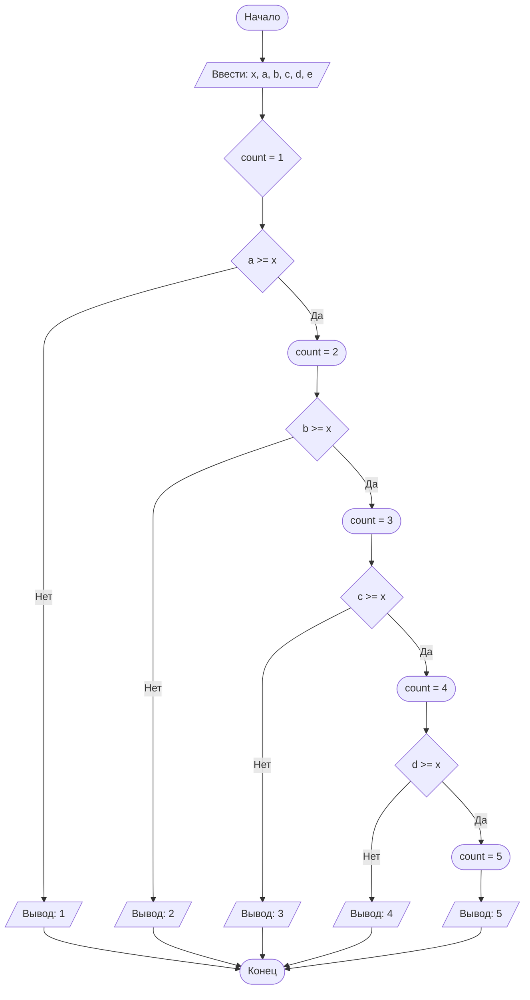

## Отчет по лабораторной работе № 1

#### № группы: `ПМ-2501`

#### Выполнила: `Плакса Мария Антоновна`

#### Вариант: `15`

### Cодержание:

- [Постановка задачи](#1-постановка-задачи)
- [Входные и выходные данные](#2-входные-и-выходные-данные)
- [Выбор структуры данных](#3-выбор-структуры-данных)
- [Алгоритм](#4-алгоритм)
- [Программа](#5-программа)
- [Анализ правильности решения](#6-анализ-правильности-решения)

### 1. Постановка задачи

>  Набор из пяти доминошек с высотами A, B, C, D, E устанавливают на
>  расстоянии X друг от друга в указанном порядке. После этого крайнюю
>  доминошку (высоты A) роняют в направлении других доминошек. Какое
>  количество доминошек упадет в результате? Считать, что доминошки име 
>  ют нулевую толщину и что доминошка упадет, если её коснется предыду
>  щая. На вход программы подаются натуральные числа X, A, B, C, D, E.

Для решения данной задачи необходимо поочередно сравнивать высоту каждой доминошки с расстоянием X. Доминошки имеют нулевую толщину, поэтому будем учитывать только их высоты и расстояние между ними. Если расстояние X меньше или равно высоте рассматриваемой доминошки, то следующая доминошка упадет. Если высота рассматриваемой доминошки меньше расстояния X, то следующая доминошка не упадет. То есть, для каждой следующей доминошки условие падения: высота предыдущей должна быть больше или равна X. Таким образом, доминошки будут поочередно падать, пока не встретится доминошка, у которой высота меньше расстояния X. Необходимо определить количество упавших доминошек. Изначально счетчик равен единице, так как первая доминошка в любом случае упадет. Далее рассматриваем каждую доминошку и проверяем условие: высота предыдущей >= X. Если условие выполняется, то добавляем единицу к счетчику, иначе выходим.       

### 2. Входные и выходные данные

#### Данные на вход

На вход программа должна получать 6 натуральных чисел.

|             | Тип                       |min значение| max значение   |
|-------------|---------------------------|------------|----------------|
| X (Число 1) | Целое положительное число | 1          |2<sup>31</sup>-1|
| A (Число 2) | Целое положительное число | 1          |2<sup>31</sup>-1|
| B (Число 3) | Целое положительное число | 1          |2<sup>31</sup>-1|
| C (Число 4) | Целое положительное число | 1          |2<sup>31</sup>-1|
| D (Число 5) | Целое положительное число | 1          |2<sup>31</sup>-1|
| E (Число 6) | Целое положительное число | 1          |2<sup>31</sup>-1|

#### Данные на выход

Так как программа должна вывести количество упавших доминошек, то на выход мы получим
единственное натуральное число, не превышающее 5.

|         | Тип                       | min значение | max значение|
|---------|---------------------------|--------------|-------------|
| Число 1 | Целое положительное число | 1            |5            |

### 3. Выбор структуры данных

Программа получает 6 натуральных чисел. Поэтому для их хранения
можно выделить 6 переменных (`x`, `a`, `b`, `c`, `d`, `e`) типа `int`, так как максимальное значение 2<sup>31</sup>-1 достаточно для любых реальных доминошек. Для подсчета количества упавших доминошек будем использовать переменную с названием `count` типа `int` с начальным значением 1.

|                | название переменной |Тип (в Java)| 
|----------------|---------------------|------------|
| X (Число 1)    | `x`                 | `int`      |
| A (Число 2)    | `a`                 | `int`      |
| B (Число 3)    | `b`                 | `int`      |
| C (Число 4)    | `c`                 | `int`      |
| D (Число 5)    | `d`                 | `int`      |
| E (Число 6)    | `e`                 | `int`      |
|count (Число 7) | `count`             | `int`      |


### 4. Алгоритм

#### Алгоритм выполнения программы:

1. **Ввод данных:**  
   Программа считывает 6 целых чисел, обозначенных как `x`, `a`, `b`, `c`, `d`, `e`.

2. **Инициализация переменной**  
   Программа создает пременную, обозначенную как `count`, и присваивает ей начальное значение, равное 1.

3. **Проверка цепочки падения и вывод результата**
    - Если высота первой доминошки `a` больше или равна `x`, то доминошка `b` падает и `count` увеличивается на 1. Иначе на экран выводится значение переменной `count` и программа завершает проверку. 
    - Если высоты первой доминошки `a` и второй доминошки `b` больше или равны `x`, то доминошка `c` падает и `count` увеличивается на 1. Иначе на экран выводится значение переменной `count` и программа завершает проверку.
    - Если высоты первой доминошки `a`, второй доминошки `b`, третьей доминошки `c` больше или равны `x`, то доминошка `d` падает и `count` увеличивается на 1. Иначе на экран выводится значение переменной `count` и программа завершает проверку.
    - Если высоты первой доминошки `a`, второй доминошки `b`, третьей доминошки `c`, четвертой доминошки `d` больше или равны `x`, то доминошка `e` падает и `count` увеличивается на 1. Затем на экран выводится значение переменной `count`.

#### Блок-схема



### 5. Программа

```java
import java.io.PrintStream;
import java.util.Scanner;

public class Main {
    // Объявляем объект класса Scanner для ввода данных
    public static Scanner in = new Scanner(System.in);
    // Объявляем объект класса PrintStream для вывода данных
    public static PrintStream out = System.out;

    public static void main(String[] args) {
        // Считывание шести целых чисел x, a, b, c, d, e из консоли
        int x = in.nextInt();
        int a = in.nextInt();
        int b = in.nextInt();
        int c = in.nextInt();
        int d = in.nextInt();
        int e = in.nextInt();
        int count = 1;


        // Сравнение a с расстоянием x
        if (a >= x) {
            // Если a больше или равно x, прибавляем к count единицу
            // Иначе выводим count
            count += 1;
            // Сравнение b с расстоянием x
            if (b >= x) {
                // Если b больше или равно x, прибавляем к count единицу
                // Иначе выводим count
                count += 1;
                // Сравнение c с расстоянием x
                if (c >= x) {
                    // Если c больше или равно x, прибавляем к count единицу
                    // Иначе выводим count
                    count += 1;
                    // Сравнение d с расстоянием x
                    if (d >= x) {
                        // Если d больше или равно x, прибавляем к count единицу, затем выводим получившееся значение count
                        count += 1;
                        out.println(count);
                    }
                    // Если d меньше x, то выводим count
                    else {
                        out.println(count);
                    }
                } else {
                    out.println(count);
                }
            } else {
                out.println(count);
            }
        } else {
                out.println(count);
            }
        }
    }
```

### 6. Анализ правильности решения
Рассмотрим несколько случаев:
1. Тест на `a >= x, b >= x, c < x, d >= x, e < x`:

    - **Input**:
        ```
        4 5 4 3 5 2
        ```

    - **Output**:
        ```
        3
        ```

2. Тест на `a >= x, b < x, c >= x, d >= x, e >= x`:

    - **Input**:
        ```
        5 5 4 6 5 6
        ```

    - **Output**:
        ```
        2
        ```

3. Тест на `a >= x, b >= x, c >= x, d < x, e >= x`:

    - **Input**:
        ```
        3 4 5 3 2 3
        ```

    - **Output**:
        ```
        4
        ```

4. Тест на `a >= x, b >= x, c >= x, d >= x, e < x` (должны упасть все доминошки):

    - **Input**:
        ```
        10 11 10 12 10 9
        ```

    - **Output**:
        ```
        5
        ```

5. Тест на `a < x, b >= x, c >= x, d >= x, e < x` (должна упасть только одна доминошка):

    - **Input**:
        ```
        3 2 3 4 5 2
        ```

    - **Output**:
        ```
        1
        ```
