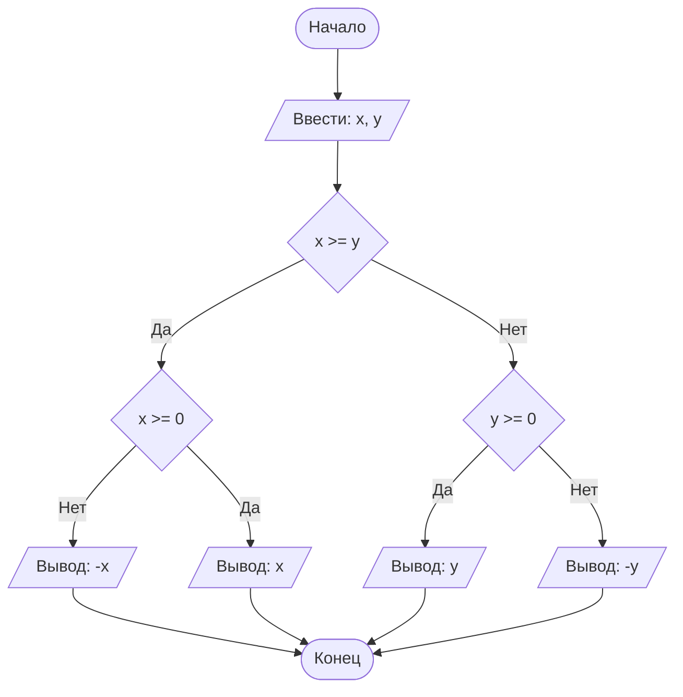

## Отчет по лабораторной работе № 1

#### № группы: `ПМ-2501`

#### Выполнила: `Плакса Мария Антоновна`

#### Вариант: `15`

### Cодержание:

- [Постановка задачи](#1-постановка-задачи)
- [Входные и выходные данные](#2-входные-и-выходные-данные)
- [Выбор структуры данных](#3-выбор-структуры-данных)
- [Алгоритм](#4-алгоритм)
- [Программа](#5-программа)
- [Анализ правильности решения](#6-анализ-правильности-решения)

### 1. Постановка задачи

>  Набор из пяти доминошек с высотами A, B, C, D, E устанавливают на
>  расстоянии X друг от друга в указанном порядке. После этого крайнюю
>  доминошку (высоты A) роняют в направлении других доминошек. Какое
>  количество доминошек упадет в результате? Считать, что доминошки име 
>  ют нулевую толщину и что доминошка упадет, если её коснется предыду
>  щая. На вход программы подаются натуральные числа X, A, B, C, D, E.

Для решения данной задачи необходимо поочередно сравнивать высоту каждой доминошки с расстоянием X. Доминошки имеют нулевую толщину, поэтому будем учитывать только их высоты и расстояние между ними. Если расстояние X меньше или равно высоте рассматриваемой доминошки, то следующая доминошка упадет. Если высота рассматриваемой доминошки меньше расстояния X, то следующая доминошка не упадет. То есть, для каждой следующей доминошки условие падения: высота предыдущей должна быть больше или равна X. Таким образом, доминошки будут поочередно падать, пока не встретится доминошка, у которой высота меньше расстояния X. Необходимо определить количество упавших доминошек. Изначально счетчик равен единице, так как первая доминошка в любом случае упадет. Далее рассматриваем каждую доминошку и проверяем условие: высота предыдущей >= X. Если условие выполняется, то добавляем единицу к счетчику, иначе выходим.       

### 2. Входные и выходные данные

#### Данные на вход

На вход программа должна получать 6 натуральных чисел.

|             | Тип                       |min значение| max значение   |
|-------------|---------------------------|------------|----------------|
| X (Число 1) | Целое положительное число | 1          |2<sup>31</sup>-1|
| A (Число 2) | Целое положительное число | 1          |2<sup>31</sup>-1|
| B (Число 3) | Целое положительное число | 1          |2<sup>31</sup>-1|
| C (Число 4) | Целое положительное число | 1          |2<sup>31</sup>-1|
| D (Число 5) | Целое положительное число | 1          |2<sup>31</sup>-1|
| E (Число 6) | Целое положительное число | 1          |2<sup>31</sup>-1|

#### Данные на выход

Так как программа должна вывести количество упавших доминошек, то на выход мы получим
единственное натуральное число, не превышающее 5.

|         | Тип                       | min значение | max значение|
|---------|---------------------------|--------------|-------------|
| Число 1 | Целое положительное число | 1            |5            |

### 3. Выбор структуры данных

Программа получает 6 натуральных чисел. Поэтому для их хранения
можно выделить 6 переменных (`x`, `a`, `b`, `c`, `d`, `e`) типа `int`, так как максимальное значение 2<sup>31</sup>-1 достаточно для любых реальных доминошек. Для подсчета количества упавших доминошек будем использовать переменную с названием `count` типа `int` с начальным значением 1.

|                | название переменной |Тип (в Java)| 
|----------------|---------------------|------------|
| X (Число 1)    | `x`                 | `int`      |
| A (Число 2)    | `a`                 | `int`      |
| B (Число 3)    | `b`                 | `int`      |
| C (Число 4)    | `c`                 | `int`      |
| D (Число 5)    | `d`                 | `int`      |
| E (Число 6)    | `e`                 | `int`      |
|count (Число 7) | `count`             | `int`      |


### 4. Алгоритм

#### Алгоритм выполнения программы:

1. **Ввод данных:**  
   Программа считывает два вещественных числа, обозначенные как `x` и `y`.

2. **Сравнение чисел:**  
   Программа сравнивает значения `x` и `y`. Если `x` больше или равно `y`, программа переходит к следующему шагу для
   работы с `x`. Если `y` больше, программа выполняет действия для работы с `y`.

3. **Проверка знака для выбранного числа:**
    - Если было выбрано число `x` (так как оно больше или равно `y`), проверяется, положительное оно или отрицательное.
      Если `x` положительное, оно выводится на экран. Если отрицательное, выводится его модуль (т.е. противоположное
      по знаку значение).
    - Если было выбрано число `y` (поскольку оно больше `x`), выполняется аналогичная проверка. Если `y` положительное,
      оно выводится на экран. Если отрицательное, выводится его модуль.

4. **Вывод результата:**  
   На экран выводится либо большее из чисел, либо его модуль, если это число отрицательное.

#### Блок-схема



### 5. Программа

```java
import java.io.PrintStream;
import java.util.Scanner;

public class Main {
    // Объявляем объект класса Scanner для ввода данных
    public static Scanner in = new Scanner(System.in);
    // Объявляем объект класса PrintStream для вывода данных
    public static PrintStream out = System.out;

    public static void main(String[] args) {
        // Считывание двух вещественных чисел x и y из консоли
        double x = in.nextDouble();
        double y = in.nextDouble();

        // Определение максимального числа
        if (x >= y) {
            // Если x положительное, выводим x, иначе выводим -x,
            // чтобы на выходе было его абсолютное значение
            if (x >= 0) {
                out.println(x);
            } else {
                out.println(-x);
            }
        } else {
            // Если x положительное, выводим y, иначе выводим -y,
            // чтобы на выходе было его абсолютное значение
            if (y >= 0) {
                out.println(y);
            } else {
                out.println(-y);
            }
        }
    }
}
```

### 6. Анализ правильности решения

Программа работает корректно на всем множестве решений с учетом ограничений.

1. Тест на `X > Y > 0`:

    - **Input**:
        ```
        5 1.3
        ```

    - **Output**:
        ```
        5
        ```

2. Тест на `X < Y < 0`:

    - **Input**:
        ```
        -4 -2.2
        ```

    - **Output**:
        ```
        2.2
        ```

3. Тест на `X < 0 < Y`:

    - **Input**:
        ```
        -4 5
        ```

    - **Output**:
        ```
        5
        ```

4. Тест на `X = 0` или `Y = 0`:

    - **Input**:
        ```
        0 -3
        ```

    - **Output**:
        ```
        3
        ```

5. Тест на ограничение задачи:

    - **Input**:
        ```
        -1000000000 1000000000
        ```

    - **Output**:
        ```
        1000000000
        ```
